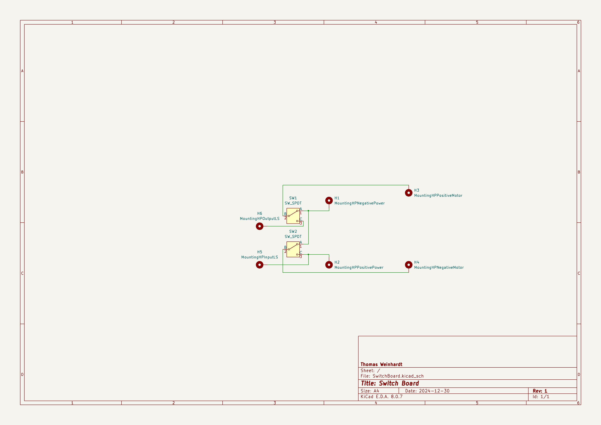
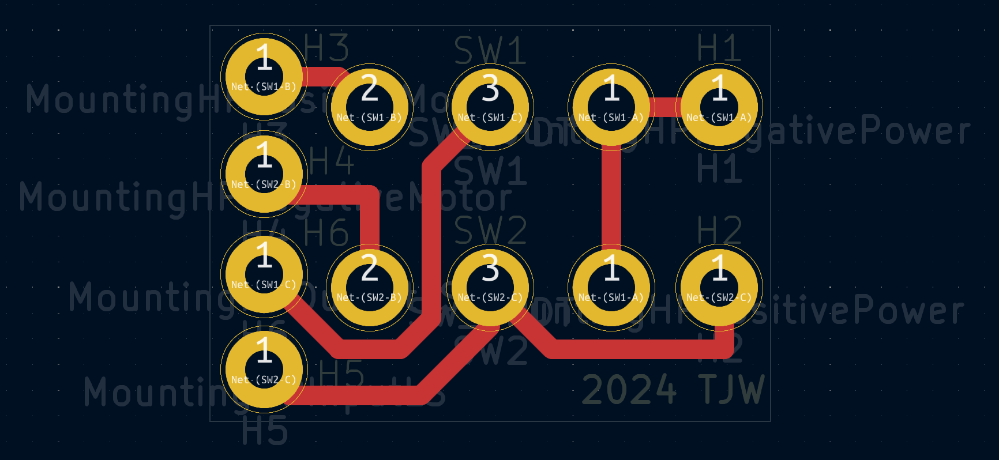

# MotorizedGrabber
3d models, custom circuit board, design and parts list for a motorized grabber design

# Grabber Shopping List

2 mm outer thickness with 22 mm inner diameter alumuinum pipe, 2 meters 

3d printer and filament, carbon fiber PLA was used for this grabber but normal PLA should still work with possibly some tweaks to the models or maybe non at all as Carbon Fiber PLA and PLA have similar print characteristics
(Note that a sleve was used for fitting the adapter to the alumnium grabber pipe better after the lave was used to trim the part till it fit with the alumium pipe, there is almost certainly another way to fit the aluminum pipe and the part together without such equipment. I would suggest tuning the fitting parts of the prints inner and outer diameter sizes till you can print a part that fits well with the aluminium pipe without any trim)

Drill Batterys and Charger https://www.amazon.com/dp/B07X2V5116/?coliid=I2IH57A649QSUQ&colid=3JNOTM74GBT0X&psc=1&ref_=list_c_wl_lv_ov_lig_dp_it

Round Head Machine Screw, 8-32-Inch x 1-Inch, 2 of them

Machine Bolt, 8-32-Inch, 2 of them

Micro Limit Switch	https://www.amazon.com/dp/B07X142VGC/?coliid=I23S51OHWOTIJK&colid=3JNOTM74GBT0X&psc=1&ref_=list_c_wl_lv_ov_lig_dp_it , I got the 10 pack of these but most limit switches will do as you only need one of them for the limiter

SPDT Push Button Switches https://www.digikey.com/en/products/detail/e-switch/700SP7B10M2QEH/502058 , I bought 4 when making it in case I messed up 2 but you only need 2 for the design

Custom Circuit Board for Grabber , The gerber files are in the repo, I used PCBWay for ordering the boards, you do have to mininum order 10 for 20 dollars but for this project it made soldering way easier and much more reliable then soldering directly to the pins.

A fair amount of 22 gage wire, I made an attempt at using quick connects to make the battery connection to the switches easier to disconnect but the current space issues make such things mildly difficult so you can just directly wire up the grabber and desolder for repairs. Annoying but with the space constraints it made sense at the time.

### An addendum on the PCB
You technically don't need this thing if your really determined but trust me when I say it really can be scuffed if you don't get this, if you are a beginner solderer I would recommend this and honestly even if your more experienced it just makes the whole circuit a lot neater. Having tiny 22 gage wires running inbetween the pins is messy, I rest my case. I have like 7 spares at this moment in time so if your really determined to not order a fresh batch you can attempt to reach out. The dupes also leave room for failures and they make for ok solder practice boards as well with the number of pins.

The spacing is also tiny there isn't a lot of room in the handle of the grabber so the board just made sense to keep things more neat

## Photos

(I used KiCAD for the board designing program)
[GerbersAndProductionFiles](SwitchBoard/pcbway_production)
Also use the settings listed in the [GrabberPCBSpecs](GrabberPCBSpecs.pdf)

